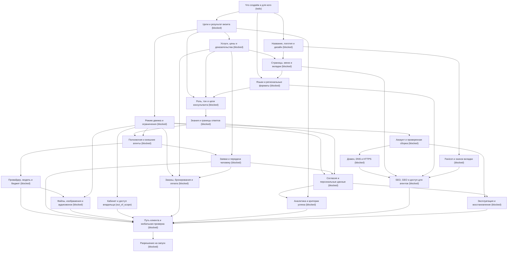

# Паспорт запуска AI-сайта

Режим: lite. Закрыто: 0/23 (0%).

К рабочему запуску не готов: остались незакрытые пункты.

Следующие доступные шаги: purpose

Ответы и доказательства намеренно не включены в этот отчёт. Статусы отражают заполненный паспорт, а не независимую проверку.

## Граф зависимостей

## Замысел

- [ ] **Что создаём и для кого** — `purpose`, todo

  - Вопрос: Как называется бизнес и чем он занимается?
  - Вопрос: Кто посетитель: его регион, язык и задача?
  - Вопрос: Какую одну основную проблему должен решать сайт?
  - Проверка: Владелец подтвердил краткое описание бизнеса и аудитории
  - Проверка: Факты отделены от предположений агента

- [ ] **Цели и результат визита** — `goals`, blocked

  Зависит от: purpose

  - Вопрос: Какое главное действие нужно: консультация, заявка, звонок, запись или покупка?
  - Вопрос: Что считать успешным визитом и как измерять результат?
  - Вопрос: Какие задачи не входят в первый запуск?
  - Проверка: Выбран основной путь посетителя и критерий успеха
  - Проверка: Объём первого запуска согласован

- [ ] **Режим движка и ограничения** — `scope`, blocked

  Зависит от: goals

  - Вопрос: Нужны ли сохраняемая история, кабинет, CRUD, встроенные заказы и бронирования?
  - Вопрос: Достаточно ли Lite с конфигурацией в файлах или нужен Standard с D1/R2?
  - Вопрос: Кто отвечает за сайт и подтверждает расходы и публикации?
  - Проверка: Выбор режима соответствует нужным функциям
  - Проверка: Владелец понимает ограничения Lite и ответственность за расходы

## Бренд и содержание

- [ ] **Название, логотип и дизайн** — `brand`, blocked

  Зависит от: purpose

  - Вопрос: Есть ли утверждённые название, логотип, цвета и шрифты?
  - Вопрос: Какие сайты или стили нравятся и чего нужно избегать?
  - Вопрос: Есть ли права на изображения, шрифты и другие материалы?
  - Проверка: Стартовый бренд заменён или его использование явно согласовано
  - Проверка: Выбран шаблон, проверены контраст текста и права на материалы

- [ ] **Favicon и значок вкладки** — `favicon`, blocked

  Зависит от: brand

  - Вопрос: Есть ли favicon именно этого бизнеса или его нужно подготовить?
  - Вопрос: Какой знак должен быть различим в размере 16 и 32 пикселя?
  - Проверка: Файл существует и указан в metadata или link rel=icon
  - Проверка: На опубликованном адресе значок загружается и виден во вкладке
  - Проверка: Наличие стартового favicon само по себе не считается готовностью бренда

- [ ] **Услуги, цены и доказательства** — `content`, blocked

  Зависит от: goals

  - Вопрос: Какие товары или услуги предлагаем: результат, цена, валюта, сроки, ограничения?
  - Вопрос: Какие FAQ, примеры, гарантии и условия можно публиковать?
  - Вопрос: Кто проверяет факты и обновляет цены?
  - Проверка: Публичные карточки и условия проверены владельцем
  - Проверка: Нет вымышленных отзывов, цен, преимуществ и обещаний

- [ ] **Страницы, меню и вкладки** — `navigation`, blocked

  Зависит от: content, brand

  - Вопрос: Какие страницы, пункты верхнего меню, вкладки чата и ссылки подвала нужны?
  - Вопрос: Для каждого раздела: ЧПУ-адрес, вкладка или модальное окно?
  - Вопрос: Что показываем на главной помимо чата и что убираем?
  - Проверка: Все пункты ведут в нужное место, нет тупиков и пустых заглушек
  - Проверка: Публичные и закрытые разделы разделены; выбранный режим поддерживает сценарии

- [ ] **Языки и региональные форматы** — `languages`, blocked

  Зависит от: purpose, navigation

  - Вопрос: Какой основной язык и нужны ли дополнительные?
  - Вопрос: Как выбирается язык сайта и ответа ассистента?
  - Вопрос: Какие часовой пояс, форматы дат, телефона и валют используются?
  - Проверка: Тексты, ошибки и основные сценарии проверены на выбранных языках
  - Проверка: Нет обещания перевода страниц, которого движок ещё не реализует

## Ассистент

- [ ] **Роль, тон и цели консультанта** — `assistant_role`, blocked

  Зависит от: goals, content, languages

  - Вопрос: Как зовут ассистента и как он объясняет, что он AI?
  - Вопрос: Какой тон: деловой или дружелюбный, ты или вы, короткие или подробные ответы?
  - Вопрос: Какие вопросы он задаёт первым и когда предлагает следующий шаг?
  - Проверка: Утверждены приветствие, роль, тон и пример идеального диалога
  - Проверка: Инструкции привязаны к цели бизнеса, без навязчивых и ложных обещаний

- [ ] **Знания и границы ответов** — `assistant_knowledge`, blocked

  Зависит от: assistant_role

  - Вопрос: На какие документы, каталог и FAQ опирается ответ?
  - Вопрос: Что делать, если данных нет, они устарели или противоречат друг другу?
  - Вопрос: Какие сведения внутренние и какие темы или обещания запрещены?
  - Проверка: Заданы отказ от выдумывания и передача человеку
  - Проверка: Секреты не помещены в prompt, публичные файлы или этот паспорт
  - Проверка: Для Lite отдельно учтено, что site.config.json публичен

- [ ] **Полномочия и внешние агенты** — `assistant_actions`, blocked

  Зависит от: assistant_knowledge, scope

  - Вопрос: Что консультант вправе только читать, предлагать или реально изменять?
  - Вопрос: Перед какими действиями обязательно подтверждение клиента или владельца?
  - Вопрос: Какие работы выполняет агент владельца через MCP, а какие требуют внешнего агента с доступом к коду?
  - Проверка: Права посетителя, консультанта и агента владельца не смешиваются
  - Проверка: Оплата, удаление, публикация и правки кода не следуют из общего разрешения на чат
  - Проверка: Неподдерживаемая операция честно передаётся человеку или внешнему агенту

- [ ] **Провайдер, модель и бюджет** — `ai_connection`, blocked

  Зависит от: assistant_actions

  - Вопрос: Какой провайдер, модель и поддерживаемый уровень рассуждения выбраны?
  - Вопрос: Кто добавит серверный ключ и какой бюджет разрешён?
  - Вопрос: Какие лимиты, отключение платных запросов и поведение при ошибках нужны?
  - Проверка: Ключ добавлен как секрет, его значение не записано в паспорт
  - Проверка: Реальный тест разрешён владельцем и выполнен; demo не считается AI-приёмкой
  - Проверка: Проверены отказ провайдера и ограничения; квота попыток не названа денежным лимитом

## Данные и действия

- [ ] **Заявки и передача человеку** — `handoff`, blocked

  Зависит от: assistant_actions, content

  - Вопрос: Куда передавать заявку: форма, кабинет, почта, телефон или мессенджер?
  - Вопрос: Какие минимальные данные нужны и когда можно их запрашивать?
  - Вопрос: Кто отвечает, в какие часы и что показать вне рабочего времени?
  - Проверка: Тестовое обращение реально получено ответственным человеком
  - Проверка: Клиент видит понятное подтверждение или ошибку, а не фиктивную отправку

- [ ] **Файлы, изображения и аудиозвонок** — `media`, blocked

  Зависит от: ai_connection, scope

  - Вопрос: Нужны ли вложения, распознавание, транскрибация и голосовой звонок?
  - Вопрос: Какие форматы, размеры, сроки хранения и согласия допустимы?
  - Вопрос: Как объяснить передачу файла или голоса внешнему провайдеру?
  - Проверка: Включены только нужные и поддерживаемые в этом режиме функции
  - Проверка: Проверены согласие, разрешения микрофона, завершение звонка и ошибки
  - Проверка: В Lite не обещано постоянное хранение файлов или истории

- [x] **Кабинет и доступ владельца** — `accounts`, out_of_scope

  - Вопрос: Кто администраторы и какие роли нужны клиентам и агентам?
  - Вопрос: Как владелец получает первый доступ и как отзывается доступ?
  - Вопрос: Какой реальный порядок помощи при потере доступа?
  - Проверка: Проверены первичный вход, чужой доступ, выход и отзыв сессий
  - Проверка: Не обещаны восстановление пароля или MFA, пока они не реализованы

- [ ] **Заказы, бронирования и оплата** — `commerce`, blocked

  Зависит от: scope, content, handoff

  - Вопрос: Нужны ли запись и оплата; встроенные или через внешний сервис?
  - Вопрос: Каковы расписание, часовой пояс, отмена, возврат, валюта и комиссии?
  - Вопрос: Кто разрешает тестовые платежи и проверяет полученный заказ?
  - Проверка: Пройден путь от выбора до подтверждённого результата и отмены
  - Проверка: Повтор запроса не создаёт повторную покупку; webhook проверяется
  - Проверка: В Lite встроенные заказы недоступны; выбран внешний путь или Standard

- [ ] **Согласия и персональные данные** — `privacy`, blocked

  Зависит от: scope, handoff, assistant_knowledge

  - Вопрос: Какие данные собираются, зачем, где хранятся и кому передаются?
  - Вопрос: Каковы сроки хранения, порядок удаления и контакт ответственного?
  - Вопрос: Кто проверит применимые требования и опубликует нужные тексты?
  - Проверка: Опубликованы согласованные правила и понятные уведомления
  - Проверка: Минимизация данных и фактическое поведение соответствуют текстам
  - Проверка: Чеклист не выдаётся за юридическое заключение

- [ ] **Аналитика и критерии успеха** — `analytics`, blocked

  Зависит от: privacy, goals

  - Вопрос: Какие события нужны: визит, вопрос, клик, заявка, оплата?
  - Вопрос: Нужны ли тексты диалогов, кто их увидит и сколько они хранятся?
  - Вопрос: Как учитываются согласие, отказ и периоды 24 часа / 7 / 30 дней?
  - Проверка: Сбор включён осознанно и проверен на тестовых событиях
  - Проверка: Секреты и ненужные личные данные не попадают в URL и события
  - Проверка: В Lite внутренние отчёты Standard не обещаются

## Публикация

- [ ] **Аккаунт и проверенная сборка** — `hosting`, blocked

  Зависит от: scope

  - Вопрос: В каком аккаунте Cloudflare и каком Worker размещаем сайт?
  - Вопрос: Кто владелец аккаунта, ресурсов и резервного доступа?
  - Вопрос: Какую сборку публикуем и где результаты preflight и тестов?
  - Проверка: Точный аккаунт и назначение подтверждены до записи
  - Проверка: Проверки выполнены для выбранной сборки; чужие ресурсы не изменены

- [ ] **Домен, DNS и HTTPS** — `domain`, blocked

  Зависит от: hosting

  - Вопрос: Есть ли собственный домен, кто им владеет и привязан ли он?
  - Вопрос: Если домена нет: покупаем отдельно или владелец принимает workers.dev для запуска?
  - Вопрос: Какой единственный основной HTTPS-адрес и нужны ли перенаправления www?
  - Проверка: Основной адрес согласован; статус собственного домена указан явно
  - Проверка: DNS и HTTPS проверены без отключения проверки сертификатов
  - Проверка: Почтовые DNS-записи и чужие домены не менялись без отдельного разрешения

- [ ] **SEO, GEO и доступ для агентов** — `seo`, blocked

  Зависит от: domain, navigation, languages, favicon

  - Вопрос: Какие запросы и регионы целевые, какие страницы индексируем?
  - Вопрос: Есть ли корректные title, description, canonical, robots, sitemap и превью ссылок?
  - Вопрос: Какие публичные Markdown, llms, JSON-LD и MCP действительно нужны и доступны?
  - Проверка: Публичные URL не содержат localhost, закрытые данные не индексируются
  - Проверка: HTML и Markdown не противоречат друг другу; ссылки и favicon проверены
  - Проверка: Отсутствующие структурированные данные или превью указаны как пробел, а не выданы за готовые

- [ ] **Эксплуатация и восстановление** — `operations`, blocked

  Зависит от: hosting, privacy

  - Вопрос: Кто следит за ошибками, доступностью, квотами и счетами?
  - Вопрос: Где хранятся исходники, конфигурация, секреты и резервные копии?
  - Вопрос: Как обновляем и откатываем сайт, как проверяем восстановление?
  - Проверка: Для Lite проверено восстановление исходников, assets и конфигурации
  - Проверка: Для Standard дополнительно отработано восстановление D1 и R2 в отдельные ресурсы
  - Проверка: Есть ответственный и порядок действий при сбое

## Приёмка

- [ ] **Путь клиента и мобильная проверка** — `qa`, blocked

  Зависит от: ai_connection, handoff, media, commerce, analytics, seo, operations

  - Вопрос: Какие 5–10 реальных вопросов и сложных ситуаций проверяем?
  - Вопрос: На каких телефонах, браузерах и с какой клавиатурой проверяем сайт?
  - Вопрос: Как проверены ошибки, отказ AI, навигация, формы и связь с человеком?
  - Проверка: Путь от первого визита до целевого действия пройден целиком
  - Проверка: Проверены контраст, клавиатура, фокус, длинные тексты и мобильный экран
  - Проверка: Проверены неизвестный вопрос, ложная предпосылка и попытка получить закрытые данные

- [ ] **Разрешение на запуск** — `launch`, blocked

  Зависит от: qa

  - Вопрос: Кто и когда утвердил итоговый сайт и оставшиеся ограничения?
  - Вопрос: Все ли критические дефекты устранены и есть ли план первых дней работы?
  - Вопрос: Когда пересматриваем содержание, качество ответов и результаты?
  - Проверка: Владелец явно разрешил рабочий запуск
  - Проверка: Сохранены доказательства проверок и список принятых ограничений
  - Проверка: Публикация Worker не подменяет приёмку бизнеса

